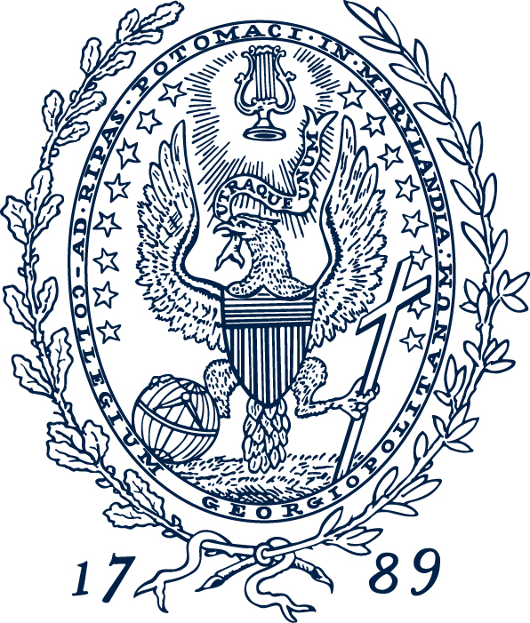
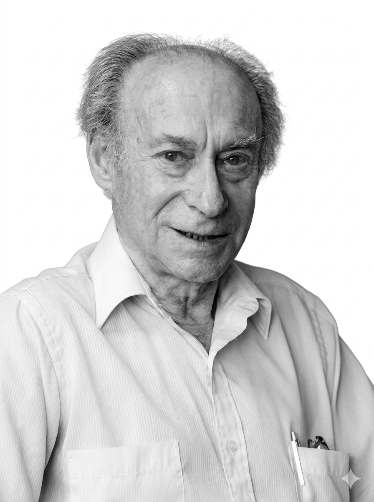

---
format:
  revealjs:
    theme: styles.scss
    transition: fade
    slide-number: true
    wide: true
    chalkboard: true
---

::: {.title-slide}

# Serving for Growth

 

**Wu Zeng, MD, PHD**  

 

{width="30%"}

 

Georgetown University

:::

# <!-- cover -->  {data-background-image="pic/life-academic.png" data-background-size="cover" data-background-position="center" data-background-opacity="1"}

---

{width="50%" fig-align="center"}

David Gil (1924-2021)

---

            

[[Folster an amiable environment for success]{.large}]{.red}

---

## Outline

- Why I run for the chair position

- Strategy areas

  - Education

  - Research

  - Faculty support

  - Inclusive and collaborative environment

---

## Experience 

- 17 years in academia

  - 7 years as an associate professor

- Teaching

  - Economics, health economics, health financing, health system, economitrics, economic evaluation (CEA), data visualization, epidemiology, biostatistics, research methods, preventive medicine

- Research

  - As PI or co-PI for more than 25 projects
  - ~ $3 million funding as PI or co-PI, excluding grants where I served as Co-I and consulting grants
  - More than 100 peer-reviewed publications, plus 65 technical reports

---

## Expererience continue... 

- Mentorship 

  - 10 PhD students, current serving on one PhD dissertation committee

- Administrative role 

  - Project lead for various research projects 
  
  - Deputy Director for a Master's Program at Brandeis

  - Senior Manager (Senior Health Economist) at Palladium

  - Assistant Dean at Shanghai Jiaotong University School of Medicine

- Finish JD degree in 2027

. . .

 

[I welcome a new opportunity to devote more of my time to supporting the growth and success of our department]{.red}

---

## Educational Program

        

 

[**Student-focus teaching**]{.red}

 

. . .

  

 

[**Modernized curriculum**]{.red}

 

. . .

  

 

[**Integrated community**]{.red}

::: {.notes}

Undergraduates

- Unique; many of them will go to med school; we want to support them to be sucessful. For those who do not go to school, ensure their success too. Early engage them in the research and publish paper.

- Keep what has been successful (expiricial learning; community engagement; collaboraiton with Quata campus; engagement at the capital campus)

Master and PhD program

- strong foundation. Attract a wide range of students. While we acknowledge that the funding and the current administration may affect the students. 

- make good use of capitol campus 

- funding for PHD, (ARHQ: training grant; MD/PHD program; collaboration with other schools)

- Funding for master's (Open Society Foundation, World Bank foundation)F

- Marketing and job landing for master students. (collaboration with the 'school of business, and targeting pharmacutical industrial; develpment areas; disease control CDC training)
:::

---

## Unique for Master's and PhD programs

        

 

[**Branding and marketing**]{.red}

 

. . .

  

 

[**Funding (fellowship)**]{.red}

---

## Research

        

 

[**Heterogenous need**]{.red}

 

. . .

  

 

[**Hard money model**]{.red}

 

. . .

  

 

[**Supportive platform and infrastructure**]{.red}

:::{.notes}
Policy: buyout policy and course banking policy 

Funding information and channel

Proposal development: Research Assistant; Proposal review; intelligence assessment; facilitate supporting the connection within and between organization

Network events: 

Project implementation: engage colleagues and studies

Financial management and incentive model

Publication 
- use students; collaborate with colleagues; make network 

Funding
- Junior faculty: try 1-2 proposals per year
- Network; conference participation; publication would also led to funding
- expanding funding channels (NIH, NSF, Wellcome Trust)
- Department support, students; joint review of proposal; methodology; GUMC can also support
- Buy-out policy, course banking policy, 
:::

---

## Faculty support 

        

 

[**Goal: Department as home**]{.red}

. . .

  

 

[**Transparency and accountability**]{.red}

 

. . .

  

 

[**Professional development**]{.red}

. . .

  

 

[**Recognition and advocacy**]{.red}

:::{.notes}
Faculty Development Committee; Training on financial management; 

Develop a research committee, Associate Dean of research

Faculty development is tied to the success of the department

ot a educaiton department but also a research department with a strong research reputation

transprancy
inclusiveness 
fairness 
:::

--- 

## Inclusive and collaborative climate and community 

 

 

> [**己所不欲，勿施於人**]{.red}

Do not do to others what you would not have them do to you

-- Confucius (551 BC - 479 BC)

> [**他山之石，可以攻玉**]{.red}

Leverage others' strength to strengthen yourself

-- Classic of Poetry （11th - 6th century BC）

:::{.notes}
I have been different position: research professor, education track, and tenure track; I understand struggle: recognition of faculty work; incentivize faculty pursure excellence in both teaching and education; advocate for faculty work; folster collaboraton; this is your home; support each other. 
:::

---

## Conclusion 

          

 

[Together]{.red}, we can make our department a great place

  

:::{.fragment}
[**Chair not as a management position, but a position to serve faculty, students, and community**]{.red}
:::

---

# Questions

Thank you — open to questions and discussion.